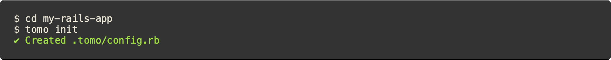
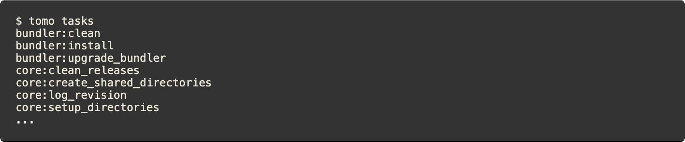
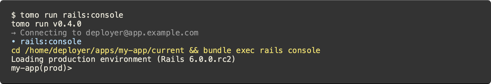
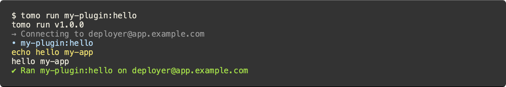

# Tomo

[](https://rubygems.org/gems/tomo)
[](https://www.ruby-toolbox.com/projects/tomo)
[](https://github.com/mattbrictson/tomo/actions/workflows/ci.yml)
[](https://codeclimate.com/github/mattbrictson/tomo)

Tomo is a friendly command-line tool for deploying Rails apps.

💻 Rich command-line interface with built-in bash completions<br/>
☁️ Multi-environment and role-based multi-host support<br/>
💎 Everything you need to deploy a basic Rails app out of the box<br/>
🔌 Easily extensible for polyglot projects (not just Rails!)<br/>
📚 Quality documentation<br/>
🔬 Minimal dependencies<br/>

[→ See how tomo compares to other Ruby deployment tools like Capistrano and Mina.](https://tomo.mattbrictson.com/comparisons/)

---

- [Quick start](#quick-start)
- [Usage](#usage)
- [Extending tomo](#extending-tomo)
- [Tutorials](#tutorials)
- [Blog posts](#blog-posts)
- [Reference documentation](#reference-documentation)
- [FAQ](#faq)
- [Support](#support)
- [License](#license)
- [Code of conduct](#code-of-conduct)
- [Contribution guide](#contribution-guide)

## Quick start

#### Installation

Tomo is distributed as a ruby gem. To install:

```
$ gem install tomo
```

> 💡 **Protip:** run `tomo completion-script` for instructions on setting up bash completions.

#### Configuring a project

Tomo is configured via a `.tomo/config.rb` file in your project. To get started, run `tomo init` to generate a configuration that works for a basic Rails app.



An abbreviated version looks like this:

```ruby
# .tomo/config.rb

plugin "git"
plugin "bundler"
plugin "rails"
# ...

host "user@hostname.or.ip.address"

set application: "my-rails-app"
set deploy_to: "/var/www/%{application}"
set git_url: "git@github.com:my-username/my-rails-app.git"
set git_branch: "main"
# ...

setup do
  run "git:clone"
  run "git:create_release"
  run "bundler:install"
  run "rails:db_schema_load"
  # ...
end

deploy do
  run "git:create_release"
  run "core:symlink_shared"
  run "core:write_release_json"
  run "bundler:install"
  run "rails:assets_precompile"
  run "rails:db_migrate"
  run "core:symlink_current"
  # ...
end
```

#### Next steps

[→ The reference docs have a complete guide to tomo configuration.](https://tomo.mattbrictson.com/configuration/)<br>
[→ Check out the **Deploying Rails From Scratch** tutorial for a step-by-step guide to using tomo with a real app.](https://tomo.mattbrictson.com/tutorials/deploying-rails-from-scratch/)

## Usage

Once your project is configured, you can:

1. Run `tomo setup` to prepare the remote host for its first deploy.
2. Run `tomo deploy` to deploy your app.
3. Use `tomo run` to invoke one-off tasks, like launching a Rails console.

> 💡 **Protip:** add `-h` or `--help` when running any of these commands to see detailed docs and examples.

### `tomo setup`

`tomo setup` prepares the remote host for its first deploy by sequentially running the
`setup` list of tasks specified in `.tomo/config.rb`. These tasks typically create directories, initialize data stores, install prerequisite tools, and perform other one-time actions that are necessary before a deploy can take place.

Out of the box, tomo will:

- Configure necessary environment variables, like `RAILS_ENV` and `SECRET_KEY_BASE`
- Install Ruby, Bundler, Node, Yarn, and dependencies
- Create all necessary deployment directories
- Create the Rails database, load the schema, and insert seed data

[→ Here is the default list of tasks invoked by the setup command.](https://tomo.mattbrictson.com/configuration#setupblock)<br>
[→ The `tomo setup` section of the reference docs explains supported command-line options.](https://tomo.mattbrictson.com/commands/setup/)

### `tomo deploy`

Whereas `tomo setup` is typically run once, you can use `tomo deploy` every time you want to deploy a new version of your app. The deploy command will sequentially run the `deploy` list of tasks specified in `.tomo/config.rb`. You can customize this list to meet the needs of your app. By default, tomo runs these tasks:

1. Create a release (using the [git:create_release](https://tomo.mattbrictson.com/plugins/git#gitcreate_release) task)
2. Build the project (e.g. [bundler:install](https://tomo.mattbrictson.com/plugins/bundler#bundlerinstall), [rails:assets_precompile](https://tomo.mattbrictson.com/plugins/rails#railsassets_precompile))
3. Migrate data to the meet the requirements of the new release (e.g. [rails:db_migrate](https://tomo.mattbrictson.com/plugins/rails#railsdb_migrate))
4. Make the new release the "current" one ([core:symlink_current](https://tomo.mattbrictson.com/plugins/core#coresymlink_current))
5. Restart the app to use the new current release (e.g. [puma:restart](https://tomo.mattbrictson.com/plugins/puma#pumarestart))
6. Perform any cleanup (e.g. [bundler:clean](https://tomo.mattbrictson.com/plugins/bundler#bundlerclean))

> 💡 **Protip:** you can abbreviate tomo commands, like `tomo d` for `tomo deploy` or `tomo s` for `tomo setup`.

[→ Here is the default list of tasks invoked by the deploy command.](https://tomo.mattbrictson.com/configuration#deployblock)<br>
[→ The `tomo deploy` section of the reference docs explains supported command-line options, like `--dry-run`.](https://tomo.mattbrictson.com/commands/deploy/)

### `tomo run [TASK]`

Tomo can also `run` individual remote tasks on demand. You can use the `tasks` command to see the list of tasks tomo knows about.



One of the built-in Rails tasks is `rails:console`, which brings up a fully-interactive Rails console over SSH.



> 💡 **Protip:** you can shorten this as `tomo rails:console` (the `run` command is implied).

[→ The `tomo run` section of the reference docs explains supported command-line options and has more examples.](https://tomo.mattbrictson.com/commands/run/)

## Extending tomo

Tomo has a powerful plugin system that lets you extend tomo by installing Ruby gems (e.g. [tomo-plugin-sidekiq](https://github.com/mattbrictson/tomo-plugin-sidekiq)). You can also define plugins on the fly within your project by adding simple `.rb` files to `.tomo/plugins/`. These plugins can define tasks as plain ruby methods. For example:

```ruby
# .tomo/plugins/my-plugin.rb

def hello
  remote.run "echo", "hello", settings[:application]
end
```

Load your plugin in `config.rb` like this:

```ruby
# .tomo/config.rb

plugin "./plugins/my-plugin.rb"
```

And run it!



[→ The **Writing Custom Tasks** tutorial has an in-depth explanation of how plugins work.](https://tomo.mattbrictson.com/tutorials/writing-custom-tasks/)<br>
[→ The **TaskLibrary** API is tomo's DSL for building tasks.](https://tomo.mattbrictson.com/api/TaskLibrary/)<br>
[→ The **Publishing a Plugin** tutorial explains how to package your plugin as a Ruby gem to share it with the community.](https://tomo.mattbrictson.com/tutorials/publishing-a-plugin/)

## Tutorials

- [Deploying Rails From Scratch](https://tomo.mattbrictson.com/tutorials/deploying-rails-from-scratch/)
- [Writing Custom Tasks](https://tomo.mattbrictson.com/tutorials/writing-custom-tasks/)
- [Publishing a Plugin](https://tomo.mattbrictson.com/tutorials/publishing-a-plugin/)

## Blog posts

- [Automate Rails deployments with GitHub Actions](https://mattbrictson.com/blog/deploy-rails-with-github-actions)

## Reference documentation

- [Configuration](https://tomo.mattbrictson.com/configuration/)
- Commands
  - [init](https://tomo.mattbrictson.com/commands/init/)
  - [setup](https://tomo.mattbrictson.com/commands/setup/)
  - [deploy](https://tomo.mattbrictson.com/commands/deploy/)
  - [run](https://tomo.mattbrictson.com/commands/run/)
  - [tasks](https://tomo.mattbrictson.com/commands/tasks/)
- Plugins
  - [core](https://tomo.mattbrictson.com/plugins/core/)
  - [bundler](https://tomo.mattbrictson.com/plugins/bundler/)
  - [env](https://tomo.mattbrictson.com/plugins/env/)
  - [git](https://tomo.mattbrictson.com/plugins/git/)
  - [nodenv](https://tomo.mattbrictson.com/plugins/nodenv/)
  - [puma](https://tomo.mattbrictson.com/plugins/puma/)
  - [rails](https://tomo.mattbrictson.com/plugins/rails/)
  - [rbenv](https://tomo.mattbrictson.com/plugins/rbenv/)
- API
  - [Host](https://tomo.mattbrictson.com/api/Host/)
  - [Logger](https://tomo.mattbrictson.com/api/Logger/)
  - [Paths](https://tomo.mattbrictson.com/api/Paths/)
  - [PluginDSL](https://tomo.mattbrictson.com/api/PluginDSL/)
  - [Remote](https://tomo.mattbrictson.com/api/Remote/)
  - [Result](https://tomo.mattbrictson.com/api/Result/)
  - [TaskLibrary](https://tomo.mattbrictson.com/api/TaskLibrary/)
  - [Testing::MockPluginTester](https://tomo.mattbrictson.com/api/testing/MockPluginTester/)

## FAQ

#### What does the `unsupported option "accept-new"` error mean?

By default, tomo uses the ["accept-new"](https://www.openssh.com/txt/release-7.6) value for the StrictHostKeyChecking option, which is supported by OpenSSH 7.6 and newer. If you are using an older version, this will cause an error. As a workaround, you can override tomo's default behavior like this:

```ruby
# Replace "accept-new" with something compatible with older versions of SSH
set ssh_strict_host_key_checking: true # or false
```

#### Can I deploy multiple apps to a single host?

Tomo relies on the host user's bash profile for various things, like setting environment variables and initializing rbenv and nodenv. This makes it impractical to deploy multiple apps to a single host using the same deploy user.

The solution is to create multiple users on the remote host, and then configure a different user for deploying each app. That way each user can have its own distinct environment variables and you can easily configure each app differently without risking conflicts. Refer to the [tomo Rails tutorial](https://tomo.mattbrictson.com/tutorials/deploying-rails-from-scratch/#set-up-a-deployer-user) for instructions on creating a deploy user.

E.g. app1 would be configured to deploy as:

```ruby
host "app1@example.com"
```

And app2 would be configured to deploy as:

```ruby
host "app2@example.com"
```

Next run `tomo setup` for _both_ apps; this will set everything up for both users on the remote host (environment variables, rbenv, etc.). You can now deploy both apps to the same host, with the confidence that their configurations will be kept cleanly separated.

#### Does tomo support git submodules?

No, not out of the box. However, you can extend tomo with an additional task for submodules; see the solution in [PR #220](https://github.com/mattbrictson/tomo/pull/220#pullrequestreview-979249573) suggested by [@numbcoder](https://github.com/numbcoder).

## Support

This project is a labor of love and I can only spend a few hours a week maintaining it, at most. If you'd like to help by submitting a pull request, or if you've discovered a bug that needs my attention, please let me know. Check out [CONTRIBUTING.md](https://github.com/mattbrictson/tomo/blob/main/CONTRIBUTING.md) to get started. Happy hacking! —Matt

## License

The gem is available as open source under the terms of the [MIT License](https://opensource.org/licenses/MIT).

## Code of conduct

Everyone interacting in the Tomo project’s codebases, issue trackers, chat rooms and mailing lists is expected to follow the [code of conduct](https://github.com/mattbrictson/tomo/blob/main/CODE_OF_CONDUCT.md).

## Contribution guide

Interested in filing a bug report, feature request, or opening a PR? Excellent! Please read the short [CONTRIBUTING.md](https://github.com/mattbrictson/tomo/blob/main/CONTRIBUTING.md) guidelines before you dive in.
