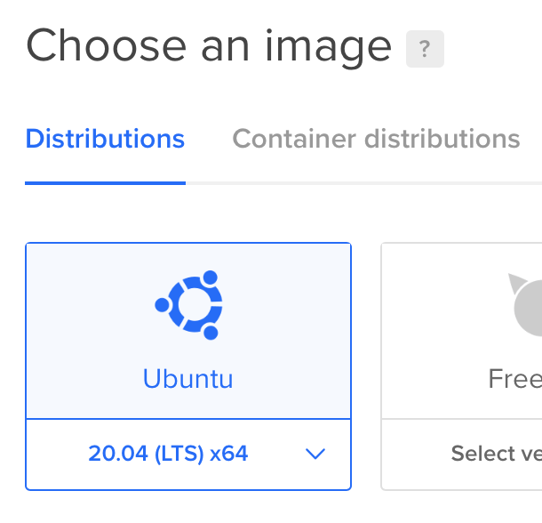
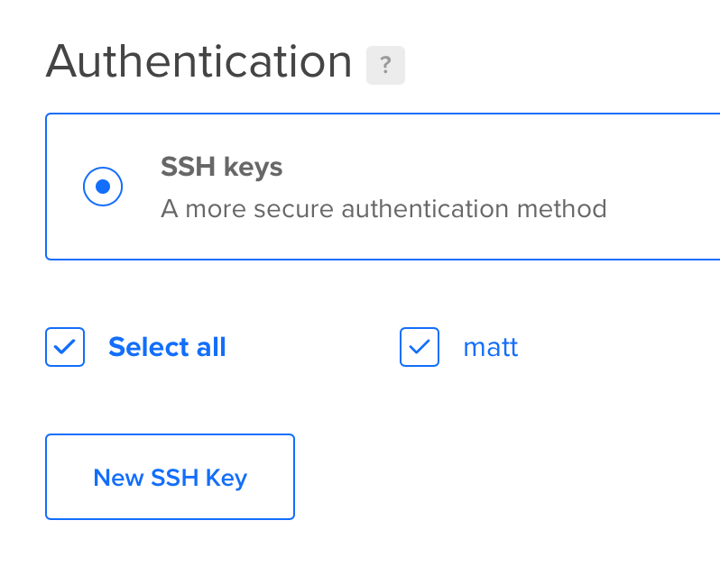

# Deploying Rails From Scratch

In this tutorial we will use tomo to deploy a [sample Rails project](https://github.com/mattbrictson/rails-new) to a virtual private server (VPS). These instructions use [DigitalOcean](https://www.digitalocean.com) as the hosting provider, but any provider that offers an Ubuntu 18.04 or 20.04 LTS VPS should work in a similar way. Here are the steps involved (step 1 is the only part that is DigitalOcean-specific):

1. [Create an Ubuntu VPS](#create-an-ubuntu-vps)
2. [Install necessary apt packages](#install-necessary-apt-packages)
3. [Set up a deployer user](#set-up-a-deployer-user)
4. [Configure tomo](#configure-tomo)
5. [Run tomo setup](#run-tomo-setup)
6. [Run tomo deploy](#run-tomo-deploy)

This is a basic tutorial that skips over DNS, TLS, load balancing, PostgreSQL, etc. If you have suggestions for expanding this guide, consider [opening an issue or pull request on GitHub](https://github.com/mattbrictson/tomo). Thanks for reading!

## Create an Ubuntu VPS

Log into [DigitalOcean](https://www.digitalocean.com) and create a "Droplet" (aka a VPS). If this is your first time using DigitalOcean, check out their [Droplet QuickStart](https://www.digitalocean.com/docs/droplets/quickstart/) guide for an introduction to the service.

When creating the Droplet, make sure to choose **Ubuntu 18.04 or 20.04 (LTS) x64**:



And use **SSH keys** for authentication (tomo does not work with password authentication):



Once the Droplet is created, confirm that you are able to connect to it (substitute `IPADDR` with the IP address provided in the DigitalOcean control panel for the new Droplet):

```sh
# Run on your local machine
$ ssh -o PasswordAuthentication=no root@IPADDR echo "authenticated as root!"
authenticated as root!
```

You may need to type `yes` when prompted to trust the host fingerprint.

## Install necessary apt packages

Rails requires certain operating system packages in order to build Ruby and install various gems that have native extensions. Connect to the VPS as root and install the following:

```sh
# Run these commands as root on the VPS
apt-get -y update
apt-get -y install build-essential zlib1g-dev libssl-dev libreadline-dev \
                   git-core curl locales libsqlite3-dev tzdata
locale-gen en_US.UTF-8
```

It may take a minute or two for all the packages to install.

## Set up a deployer user

Running a Rails app as `root` is a security risk; we need to create a non-privileged user for this purpose. Run the following script to create a
`deployer` user that:

- has access to write to a `/var/www` directory, which is the default location where tomo will deploy our app; and
- can "linger", i.e. run long-running processes like the puma web server

```sh
# Run these commands as root on the VPS
adduser --disabled-password deployer < /dev/null
mkdir -p /home/deployer/.ssh
cp /root/.ssh/authorized_keys /home/deployer/.ssh
chown -R deployer:deployer /home/deployer/.ssh
chmod 600 /home/deployer/.ssh/authorized_keys
mkdir -p /var/www
chown deployer:deployer /var/www
loginctl enable-linger deployer
```

For convenience, the `deployer` user will accept the same SSH key that you are already using to authenticate when connecting as `root`. Test that it works:

```sh
# Run on your local machine
$ ssh -o PasswordAuthentication=no deployer@IPADDR echo "authenticated as deployer!"
authenticated as deployer!
```

## Configure tomo

We will be deploying [this basic Rails app](https://github.com/mattbrictson/rails-new). Clone the repository to get started:

```sh
# Run on your local machine
$ git clone https://github.com/mattbrictson/rails-new
```

Inside the `rails-new` directory, install tomo and run `tomo init`. This will set up a deploy configuration with a good set of defaults:

```sh
# Run on your local machine
$ cd rails-new

$ gem install tomo
Fetching tomo-1.11.0.gem
Successfully installed tomo-1.11.0
1 gem installed

$ tomo init
✔ Created .tomo/config.rb
```

The `.tomo/config.rb` configuration is ready right out of the box. All you will need to change is the `host` line, and be sure to replace `IPADDR` with the IP address of your VPS:

```ruby
# Modify the 'host' line of .tomo/config.rb
host "deployer@IPADDR"
```

## Run tomo setup

Tomo comes with a `setup` command that will prepare your VPS for its first deployment. This does things like install Node, Yarn, and Ruby. It also sets up some important environment variables. Just run:

```sh
# Run on your local machine
$ tomo setup
```

You will be asked for two environment variables. Tomo will store these values on the VPS so that you only have to provide them once:

- **DATABASE_URL** is needed to tell Rails how to connect to the database. The basic app we are deploying uses sqlite. Provide this value when prompted: `sqlite3:/var/www/rails-new/shared/production.sqlite3`. This will store the database in a shared location so that it doesn't change from release to release.
- **SECRET_KEY_BASE** is needed by all Rails apps to securely encrypt session cookies and other important data. Run `ruby -rsecurerandom -e "puts SecureRandom.hex(64)"` to generate an appropriate value.

Note that `tomo setup` compiles Ruby from source, which will take several minutes.

## Run tomo deploy

Once `setup` completes, your VPS is ready to go. Deploying is now just a matter of running `tomo deploy`:

```sh
# Run on your local machine
$ tomo deploy
```

When the deploy completes, the Rails app will be accessible on port 3000 of your VPS: `http://IPADDR:3000`.

Congratulations!
