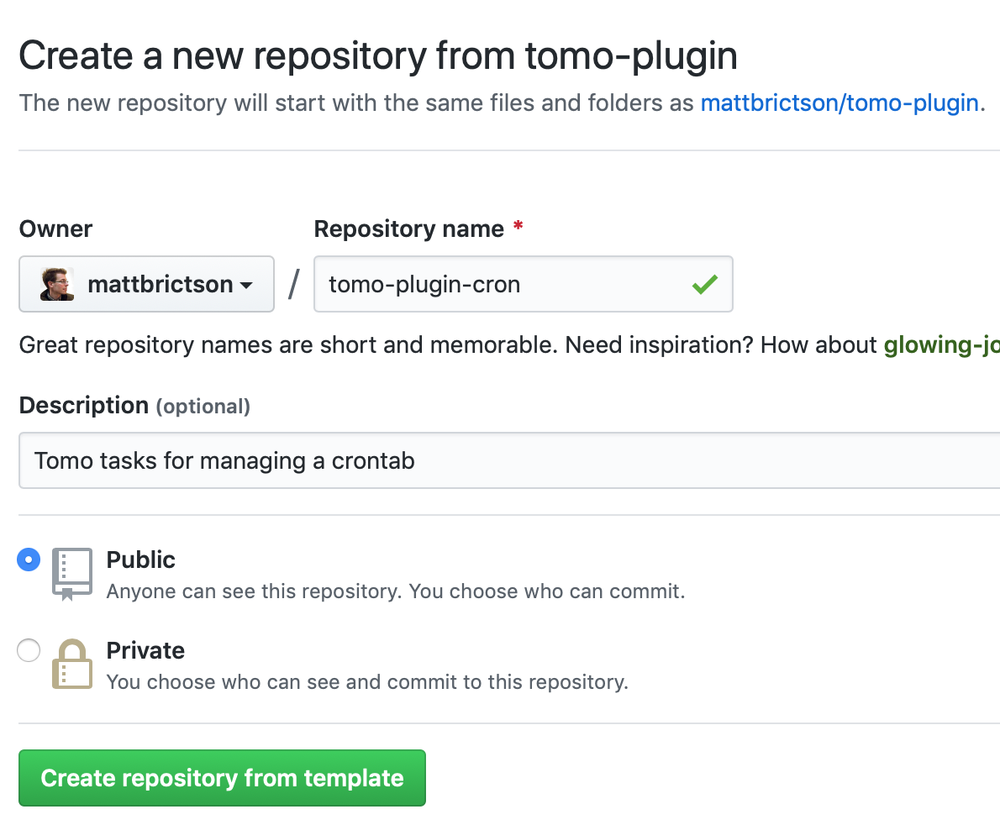

# Publishing a Plugin

In this tutorial we will package a tomo plugin so that it can be shared with the community as a Ruby gem. Here is a quick reference to the steps involved in creating a plugin gem:

- Start with a [project-based plugin](writing-custom-tasks.md) to prove real-world usage
- Use the [tomo-plugin GitHub template](https://github.com/mattbrictson/tomo-plugin) to package your plugin as a Ruby gem
- Write unit tests for your tasks using [MockPluginTester](../api/testing/MockPluginTester.md)
- Add docs and continuous integration (CI) to help your users and contributors
- Publish to [rubygems.org](https://rubygems.org)

To keep things simple, we'll package the example cron plugin that we created in the [Writing Custom Tasks tutorial](writing-custom-tasks.md). Check out that article for more details on writing plugins and tasks. Here we will focus just on the gem packaging part.

## Create the gem

While it is easy to get started writing tasks with a project-based plugin, this ad-hoc style does not have test coverage and is not packaged in a way that makes it easy to share with other projects and the larger tomo community. This is why it is useful to package your plugin in its own Ruby gem project.

### Choose a name

Before packaging your plugin, choose a name. Your gem will be named `tomo-plugin-NAME` where `NAME` is the name of your plugin. Decide on a plugin name that is concise and whose gem name is not already taken at [rubygems.org](https://rubygems.org). For example the "sidekiq" plugin corresponds to the [tomo-plugin-sidekiq](https://rubygems.org/gems/tomo-plugin-sidekiq) gem at rubygems.org.

### Use the tomo-plugin template

Tomo provides a GitHub template that does most of the work of setting up the gem project.

1. Navigate to the [tomo-plugin](https://github.com/mattbrictson/tomo-plugin) template on GitHub
2. Press [Use this template](https://github.com/mattbrictson/tomo-plugin/generate)
3. Name the repo `tomo-plugin-NAME` where `NAME` is the name of the plugin



For this example we will use "cron" as the plugin name.

### Run the rename_template.rb script

Use git to clone the resulting GitHub repo. Inside the repo, run:

```plain
$ ruby rename_template.rb
```

This will prompt for some information needed to set up the project. Press enter to accept the default values, which should be sufficient for each question.

```plain
>>>> git remote -v
>>>> git remote get-url origin
>>>> git config user.email
>>>> git config user.name
Plugin name? [cron]
Gem summary (< 60 chars)? [cron tasks for tomo]
Author email? [opensource@mattbrictson.com]
Author name? [Matt Brictson]
GitHub repository? [mattbrictson/tomo-plugin-cron]
Create GitHub labels? [Y/n]

I need to ask for your GitHub credentials in order to create labels.
Don't worry, your GitHub credentials will NOT be saved.

GitHub username? [mattbrictson]
GitHub password?
2FA token? 012345
Created labels: ⚠️ Breaking, 🐛 Bug Fix, 📚 Docs, ✨ Feature, 🏠 Housekeeping
>>>> git mv .github/workflows/push.yml.dist .github/workflows/push.yml
>>>> git add LICENSE.txt
>>>> git add Rakefile
>>>> git add README.md
>>>> git add CHANGELOG.md
>>>> git add CODE_OF_CONDUCT.md
>>>> git add bin/console
>>>> git add example.gemspec
>>>> git mv example.gemspec tomo-plugin-cron.gemspec
>>>> git add lib/tomo/plugin/example.rb
>>>> git mv lib/tomo/plugin/example.rb lib/tomo/plugin/cron.rb
>>>> git add lib/tomo/plugin/example/version.rb
>>>> git add lib/tomo/plugin/example/helpers.rb
>>>> git mv lib/tomo/plugin/example/helpers.rb lib/tomo/plugin/cron/helpers.rb
>>>> git add lib/tomo/plugin/example/tasks.rb
>>>> git mv lib/tomo/plugin/example/tasks.rb lib/tomo/plugin/cron/tasks.rb
>>>> git add lib/tomo/plugin/example/version.rb
>>>> git mv lib/tomo/plugin/example/version.rb lib/tomo/plugin/cron/version.rb
>>>> git add lib/tomo/plugin/cron.rb
>>>> git add lib/tomo/plugin/cron/version.rb
>>>> git add test/tomo/plugin/example_test.rb
>>>> git mv test/tomo/plugin/example_test.rb test/tomo/plugin/cron_test.rb
>>>> git add test/tomo/plugin/example/helpers_test.rb
>>>> git add test/tomo/plugin/example/helpers_test.rb
>>>> git mv test/tomo/plugin/example/helpers_test.rb test/tomo/plugin/cron/helpers_test.rb
>>>> git add test/tomo/plugin/example/tasks_test.rb
>>>> git add test/tomo/plugin/example/tasks_test.rb
>>>> git mv test/tomo/plugin/example/tasks_test.rb test/tomo/plugin/cron/tasks_test.rb
>>>> git add test/test_helper.rb
>>>> git rm rename_template.rb

All set!

The project has been renamed to "tomo-plugin-cron".
Review the changes and then run:

  git commit && git push

```

Don't forget to `git commit` and `git push` the changes.

## Define the plugin

The entry point for a tomo plugin gem is the `lib/tomo/plugin/<name>.rb` file. This file defines the plugin by extending [Tomo::PluginDSL](../api/PluginDSL.md) to provide the following three pieces of information:

1. Default settings
2. Tasks
3. Helpers

For our "cron" plugin, the entry point generated from the template looks like this:

```ruby
# lib/tomo/plugin/cron.rb

require "tomo"
require_relative "cron/helpers"
require_relative "cron/tasks"
require_relative "cron/version"

module Tomo::Plugin::Cron
  extend Tomo::PluginDSL

  # TODO: initialize this plugin's settings with default values
  # defaults cron_setting: "foo",
  #          cron_another_setting: "bar"

  tasks Tomo::Plugin::Cron::Tasks
  helpers Tomo::Plugin::Cron::Helpers
end
```

### Default settings

It is a good practice to provide default values for _all_ settings that your plugin relies on. If there is truly no default value for a setting, declare it as `nil`. This at least informs tomo the name of the setting that the plugin is expecting.

Our cron plugin needs a crontab template that has no default value (the user of the plugin will need to provide it):

```ruby
defaults cron_template_path: nil
```

Notice how we've named the setting starting with `cron_`. This is a convention that makes it clear to users which settings correspond to which plugin, and reduces the unintended collisions.

### Tasks

By default, the tasks of the plugin are defined in a file `lib/tomo/plugin/<name>/tasks.rb`. It looks like this:

```ruby
# lib/tomo/plugin/cron/tasks.rb

module Tomo::Plugin::Cron
  class Tasks < Tomo::TaskLibrary
    # tasks go here
  end
end
```

We can copy the tasks from the [Writing Custom Tasks tutorial](writing-custom-tasks.md) into this file with a few modifications to use the new `:cron_template_path` setting we just defined:

```ruby
# lib/tomo/plugin/cron/tasks.rb

module Tomo::Plugin::Cron
  class Tasks < Tomo::TaskLibrary
    def show
      remote.run "crontab -l", raise_on_error: false
    end

    def install
      require_setting :cron_template_path

      crontab = merge_template(settings[:cron_template_path])
      remote.run "echo #{crontab.shellescape} | crontab -",
                 echo: "echo [template:.tomo/templates/crontab.erb] | crontab -"
    end
  end
end
```

Note the `require_setting` line will check that the user has provided a value for the `:cron_template_path` setting and will show a helpful error message if it is missing.

### Helpers

Helpers extend the `remote` DSL in tomo. This is an advanced feature that most plugins will not use. We can remove it from our plugin:

- Delete `lib/tomo/plugin/cron/helpers.rb`
- Delete `test/tomo/plugin/cron/helpers_test.rb`
- Remove the following lines from `lib/tomo/plugin/cron.rb`
  - `require_relative "cron/helpers"`
  - `helpers Tomo::Plugin::Cron::Helpers`

## Write tests

Tomo makes it easy to write tests in a plugin gem using the [MockPluginTester](../api/testing/MockPluginTester.md). MockPluginTester works by mocking the underlying SSH connection so that no actual remote SSH scripts are run. By default, the tester will simulate that the script runs successfully (exit status of 0) with empty stdout and stderr. You can then write assertions verifying that the script was run as expected.

Here's what tests look like for the tasks of our hypothetical cron plugin:

```ruby
# test/tomo/plugin/cron/tasks_test.rb

require "test_helper"
require "tempfile"

class Tomo::Plugin::Cron::TasksTest < Minitest::Test
  def test_show
    tester = Tomo::Testing::MockPluginTester.new("cron")
    tester.run_task("cron:show")
    assert_equal("crontab -l", tester.executed_script)
  end

  def test_install
    # Create a sample crontab template for use in the test
    crontab = "0 6 * * * echo hi\n"
    crontab_file = Tempfile.new
    crontab_file << crontab
    crontab_file.close

    tester = Tomo::Testing::MockPluginTester.new(
      "cron", settings: { cron_template_path: crontab_file.path }
    )

    tester.run_task("cron:install")

    assert_equal(
      "echo #{crontab.shellescape} | crontab -",
      tester.executed_script
    )
  end
end
```

To run the tests:

```plain
$ bundle exec rake
Started with run options --seed 29280

Tomo::Plugin::CronTest
  test_that_it_has_a_version_number                               PASS (0.00s)

Tomo::Plugin::Cron::TasksTest
  test_install                                                    PASS (0.03s)
  test_show                                                       PASS (0.00s)

Finished in 0.03056s
3 tests, 3 assertions, 0 failures, 0 errors, 0 skips
Running RuboCop...
Inspecting 12 files
............

12 files inspected, no offenses detected
```

## Try it out

Unit tests are valuable but no substitute for trying out your plugin gem in a real-world scenario. There are two easy ways to try your gem before publishing.

One option is to install the gem into your local Ruby environment like this:

```plain
$ bundle exec rake install
```

Now your plugin will be available anywhere you use `tomo` on your local system.

However, that won't work for a project where you are managing tomo gems via Bundler. In that case, edit the Gemfile of the project to reference your plugin by `path`:

```ruby
gem "tomo-plugin-cron", path: "../tomo-plugin-cron"
```

Run `bundle install` and now your plugin will be available via `bundle exec tomo`.

## Write a good README

The tomo-plugin template will create a basic README but it is up to you to fill in the details. In particular users will be interested to know what tasks your plugin provides and how to configure it. Make sure to fill in the Settings and Tasks sections of the README. In the case of our hypothetical cron plugin, we'd want to specify installation instructions as well, to explain that the `cron:install` task should be listed part of the `setup` tasks. Check out [tomo-plugin-sidekiq](https://github.com/mattbrictson/tomo-plugin-sidekiq/blob/master/README.md) for an example README.

## Set up CI

The tomo-plugin template will set your gem project up with Travis, Circle CI, and Code Climate out of the box, but it is up to you to log into those services and turn them on. Here are some links to get you started:

- [Circle CI](https://circleci.com/): Log in via your GitHub account and then click **Add Projects**.
- [Code Climate](https://codeclimate.com): Log into the Quality product via your GitHub account, click **Open Source**, then **Add a repository**.
- [Travis CI](https://travis-ci.org/): Log into travis-ci.org via your GitHub account, go to **Settings**, then enable your gem project in the **Repositories** section.

These services will build and test your project on every push and PR and update the status badges in your README.

## Publish to rubygems.org

Once you are ready to share your gem with the world, [create a rubygems.org account](https://rubygems.org/sign_up) if you haven't already. Then ensure you are logged in via the `gem` CLI:

```plain
$ gem signin
```

To publish, run:

```plain
$ bundle exec rake release
```

Finally, don't forget to document your release with release notes in the Releases section of your project on GitHub.

### Releasing a new version

If you've already published your gem and want to release a new version, first edit the `version.rb` file:

```ruby
# lib/tomo/plugin/cron/version.rb

module Tomo::Plugin::Cron
  VERSION = "0.2.0".freeze
end
```

Commit the changes:

```plain
$ git commit -a -m "Release v0.2.0"
```

And then release:

```plain
$ bundle exec rake release
```

Once again, don't forget the release notes on GitHub.

That's it!
